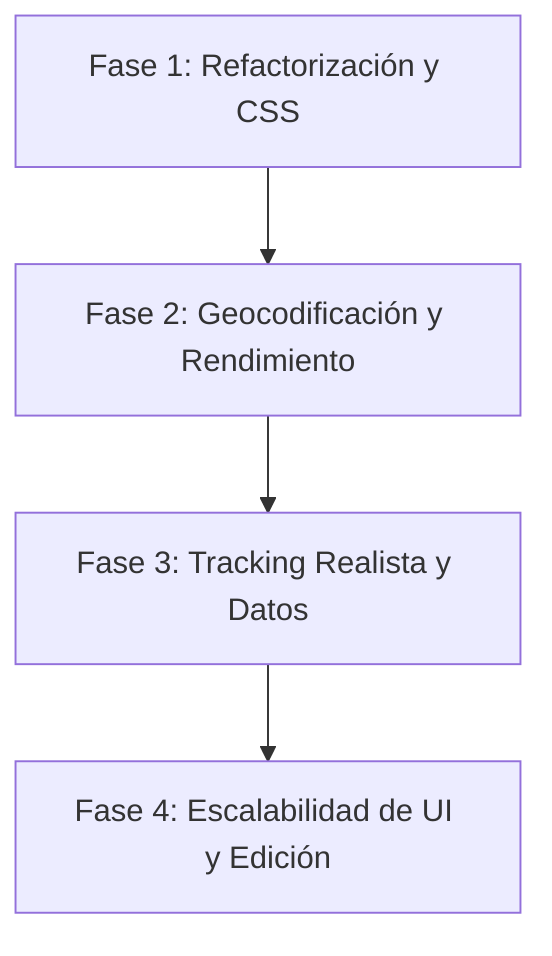

# Hoja de Ruta de Desarrollo (Roadmap) y Plan de Tareas

Este documento detalla el plan de trabajo estructurado por fases y tareas específicas para resolver los problemas detectados en la auditoría y llevar el sistema a un nivel óptimo de calidad y escalabilidad.

---

## Estructura de Fases y Tareas

---

## Fase 1: Refactorización Estructural y CSS Semántico

### Tarea 1.1: Evitar Polución Global en JavaScript
* **Descripción**: Encapsular el código de [app.js](file:///C:/Users/HuGOD777/proyectos%20practica/gestion.0.0.2/js/app.js) en un módulo de ES6 o en una estructura de módulo autocontenida (IIFE / objeto App) para eliminar variables del espacio global (`window`).
* **Criterios de Aceptación**:
  - Ninguna variable (`envios`, `contadorId`, `mapa`, etc.) ni función debe exponerse en el objeto global `window`.
  - La aplicación funciona exactamente igual tras la encapsulación.
* **Verificación**:
  - Abrir la consola del desarrollador y ejecutar `window.envios` o `window.mapa`. Debe retornar `undefined`.
* **Archivos a tocar**:
  - [js/app.js](file:///C:/Users/HuGOD777/proyectos%20practica/gestion.0.0.2/js/app.js)
  - [index.html](file:///C:/Users/HuGOD777/proyectos%20practica/gestion.0.0.2/index.html) (cambiar tipo de script a `type="module"` o enlazar archivo adecuadamente).
* **Alcance Estimado**: S (1-2 archivos).

### Tarea 1.2: Migración a Variables CSS (:root)
* **Descripción**: Extraer los colores repetidos, fuentes y tamaños comunes en [styles.css](file:///C:/Users/HuGOD777/proyectos%20practica/gestion.0.0.2/css/styles.css) a variables `:root` de CSS, facilitando cambios de diseño y futuro soporte de temas.
* **Criterios de Aceptación**:
  - El archivo CSS usa variables (`--color-primary`, `--bg-dark`, `--color-success`, etc.) para todas las propiedades comunes.
  - La apariencia visual de la aplicación se mantiene intacta.
* **Verificación**:
  - Inspeccionar los estilos y validar la correcta herencia de variables desde `:root`.
* **Archivos a tocar**:
  - [css/styles.css](file:///C:/Users/HuGOD777/proyectos%20practica/gestion.0.0.2/css/styles.css)
* **Alcance Estimado**: S (1 archivo).

### Tarea 1.3: Gestión de Errores e Indicadores Visuales en UI
* **Descripción**: Reemplazar los `try-catch` vacíos con un flujo de captura de errores real. Crear un sistema básico de Toasts o Alertas visuales no invasivas en pantalla para notificar fallos (ej. cuando la red falle al pedir rutas).
* **Criterios de Aceptación**:
  - Si la llamada a OSRM falla o localStorage arroja un error, se muestra un Toast/notificación en pantalla.
  - Los errores se registran en la consola de manera descriptiva con `console.error()`.
* **Verificación**:
  - Simular modo sin conexión a internet y agregar un envío. Debe aparecer un mensaje visual informando del fallback de distancia estimado.
* **Archivos a tocar**:
  - [js/app.js](file:///C:/Users/HuGOD777/proyectos%20practica/gestion.0.0.2/js/app.js)
  - [css/styles.css](file:///C:/Users/HuGOD777/proyectos%20practica/gestion.0.0.2/css/styles.css)
* **Alcance Estimado**: S (2 archivos).

---

### Punto de Control 1 (Checkpoint: Base Limpia y Robusta)
- [ ] No hay variables expuestas globalmente.
- [ ] La UI responde y se visualiza perfectamente usando tokens de diseño CSS.
- [ ] Las fallas de red muestran alertas amigables al usuario.

---

## Fase 2: Geocodificación y Carga Eficiente de Mapas

### Tarea 2.1: Geocodificación Dinámica mediante la API de Nominatim
* **Descripción**: Sustituir el objeto de mapeo estático de ciudades (`ciudadesBase`) por una llamada dinámica a la API pública de Nominatim para geocodificar las cadenas que el usuario ingrese en Origen y Destino.
* **Criterios de Aceptación**:
  - El usuario puede ingresar cualquier ciudad o dirección real.
  - La API de Nominatim resuelve la latitud/longitud en tiempo de ejecución.
  - Se implementa un indicador visual de "Buscando coordenadas..." al agregar un envío.
* **Verificación**:
  - Agregar un envío con origen "Berlin" y destino "Munich". Ambos deben aparecer en el mapa con sus ubicaciones correctas europeas.
* **Archivos a tocar**:
  - [js/app.js](file:///C:/Users/HuGOD777/proyectos%20practica/gestion.0.0.2/js/app.js)
* **Alcance Estimado**: M (1 archivo, cambio de lógica interna).

### Tarea 2.2: Paralelismo y Caché en Rutas OSRM
* **Descripción**: Modificar la función `renderMapa` para evitar las llamadas HTTP secuenciales que ralentizan la interfaz. Implementar `Promise.all` para paralelizar peticiones pendientes y guardar las rutas calculadas en LocalStorage para no re-calcularlas al renderizar de nuevo.
* **Criterios de Aceptación**:
  - Las peticiones de ruta se resuelven en paralelo al cargar el mapa.
  - El mapa se actualiza sin demoras apreciables y sin duplicidad de marcadores (evitar race conditions).
* **Verificación**:
  - Monitorear la pestaña "Network" en DevTools y verificar que las llamadas OSRM ocurren concurrentemente y no en cadena.
* **Archivos a tocar**:
  - [js/app.js](file:///C:/Users/HuGOD777/proyectos%20practica/gestion.0.0.2/js/app.js)
* **Alcance Estimado**: M (1 archivo).

---

### Punto de Control 2 (Checkpoint: Geocodificación y Carga Eficiente)
- [ ] Las ciudades se geolocalizan dinámicamente en cualquier parte del mundo.
- [ ] El mapa carga instantáneamente al usar llamadas concurrentes y caché local.

---

## Fase 3: Simulación de Tracking Vial e Higiene de Datos

### Tarea 3.1: Interpolación de Tracking sobre Rutas Viales Reales
* **Descripción**: Modificar el simulador de tracking en tiempo real para que mueva los marcadores a lo largo de los puntos geográficos de la polyline vial devuelta por OSRM, en lugar de moverse en línea recta.
* **Criterios de Aceptación**:
  - El camión sigue la línea del mapa (calles/carreteras) desde origen hasta destino de forma fluida.
  - Al llegar al destino, el estado del envío cambia a "Entregado" automáticamente o finaliza su trayecto de simulación.
* **Verificación**:
  - Activar un envío "En Tránsito". Observar que el icono del camión se desplaza siguiendo la carretera dibujada y no cruza montañas.
* **Archivos a tocar**:
  - [js/app.js](file:///C:/Users/HuGOD777/proyectos%20practica/gestion.0.0.2/js/app.js)
* **Alcance Estimado**: M (1 archivo).

### Tarea 3.2: Higiene del Estado y Prevención de Fugas de Memoria
* **Descripción**: Limpiar adecuadamente las propiedades de simulación, marcadores y polylines cuando un envío sea eliminado o cuando cambie su estado de "En Tránsito" a otro estado.
* **Criterios de Aceptación**:
  - Al borrar un envío, su marcador, ruta y objeto de tracking se remueven de la memoria global y del mapa al instante.
  - No queda rastro de IDs huérfanos en `posicionesSimuladas` ni en el mapa de Leaflet.
* **Verificación**:
  - Agregar un envío "En Tránsito", eliminarlo, e inspeccionar `posicionesSimuladas` por consola. El ID no debe figurar en el objeto.
* **Archivos a tocar**:
  - [js/app.js](file:///C:/Users/HuGOD777/proyectos%20practica/gestion.0.0.2/js/app.js)
* **Alcance Estimado**: S (1 archivo).

---

### Punto de Control 3 (Checkpoint: Simulación e Higiene)
- [ ] El tracking en tiempo real es realista y sigue carreteras.
- [ ] Al eliminar envíos, se libera la memoria y se limpian los elementos del mapa adecuadamente.

---

## Fase 4: Escalabilidad y Funcionalidades de UI

### Tarea 4.1: Buscador, Filtros y Paginación de Envíos
* **Descripción**: Agregar campos de entrada en la cabecera de la tabla de envíos para permitir buscar por producto, filtrar por estado (Pendiente, En Tránsito, Entregado) y paginar los envíos para evitar colapsar la página con grandes cantidades de datos.
* **Criterios de Aceptación**:
  - El usuario puede filtrar y ordenar la tabla de envíos rápidamente.
  - La tabla implementa paginación básica (ej. 10 elementos por página).
* **Verificación**:
  - Cargar 15 envíos de prueba y verificar el correcto funcionamiento del filtro por estado y de los botones de página siguiente/anterior.
* **Archivos a tocar**:
  - [index.html](file:///C:/Users/HuGOD777/proyectos%20practica/gestion.0.0.2/index.html)
  - [js/app.js](file:///C:/Users/HuGOD777/proyectos%20practica/gestion.0.0.2/js/app.js)
  - [css/styles.css](file:///C:/Users/HuGOD777/proyectos%20practica/gestion.0.0.2/css/styles.css)
* **Alcance Estimado**: M (3 archivos).

### Tarea 4.2: Formulario de Edición de Envíos Existentes
* **Descripción**: Modificar el formulario para permitir la edición de cualquier envío existente (cambiar su cantidad, peso, ciudades, etc.) cargando los datos de vuelta en el panel de carga en modo "Editar".
* **Criterios de Aceptación**:
  - Botón "Editar" en las filas de la tabla de envíos.
  - Al pulsar, el formulario se rellena con los datos actuales y el botón de submit cambia a "Actualizar Envíos".
  - Al guardar, se actualizan los datos y el mapa recalcula la ruta si cambiaron las ciudades.
* **Verificación**:
  - Editar un envío existente, cambiar la cantidad de 5 a 100, presionar "Actualizar" y confirmar los cambios en la tabla y en los KPIs.
* **Archivos a tocar**:
  - [js/app.js](file:///C:/Users/HuGOD777/proyectos%20practica/gestion.0.0.2/js/app.js)
  - [index.html](file:///C:/Users/HuGOD777/proyectos%20practica/gestion.0.0.2/index.html)
* **Alcance Estimado**: S (2 archivos).

---

### Punto de Control 4 (Checkpoint: Listo para Producción Básica)
- [ ] La tabla de envíos puede buscar, filtrar y paginar con eficiencia.
- [ ] Los usuarios pueden editar cualquier campo de los envíos de forma integrada.
