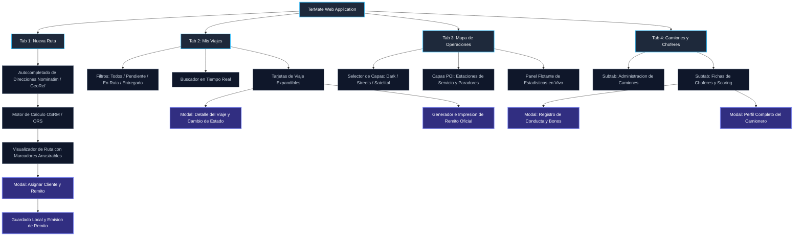
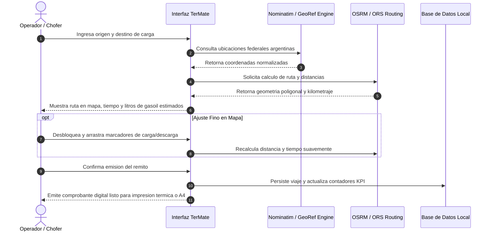
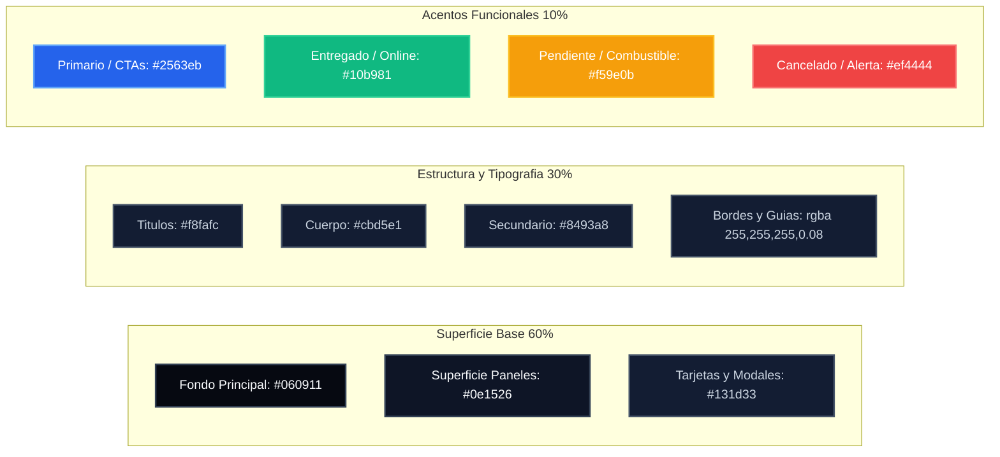
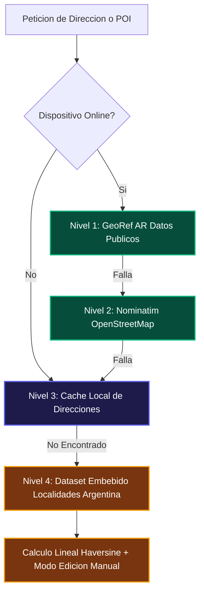

# TerMate Design System & Arquitectura de Interfaz

## 1. Vision y Filosofia de Producto
TerMate es la plataforma de gestion logistica, trazado de rutas de transporte pesado y emision digital de remitos en la Republica Argentina.
Disenada bajo principios Mobile-First, ergonomia tactil para choferes en cabina y visualizacion integral para operadores logisticos de escritorio.

---

## 2. Flujo Integral de Pantallas (Screen Flow Architecture)

---

## 3. Flujo de Usuario (User Journey Map)

---

## 4. Sistema de Color y Tokens (Regla 60 / 30 / 10)

---

## 5. Arquitectura de Geocodificacion y Resiliencia Offline

---

## 6. Jerarquia de Aislamiento Visual (Z-Index)
- `Header y Sidebar`: `z-index: 5000` (Fijos y visibles siempre por encima del contenido).
- `Bottom Navigation Bar`: `z-index: 5000` (Ergonomia tactil fija en la base de la pantalla sin superposiciones).
- `Modales y Dialogos`: `z-index: 9000` (Aislamiento completo sobre la capa de trabajo).
- `Notificaciones Toast`: `z-index: 9999` (Feedback de sistema en primer plano).
- `Capas de Mapa Leaflet`: `z-index: 5` a `25` (Contenidas estrictamente dentro de su contenedor).
