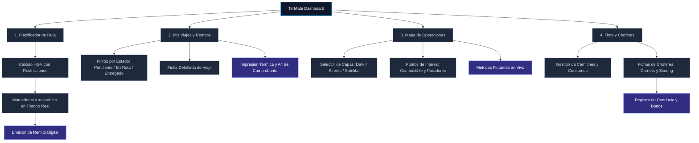
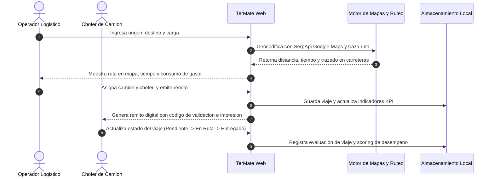
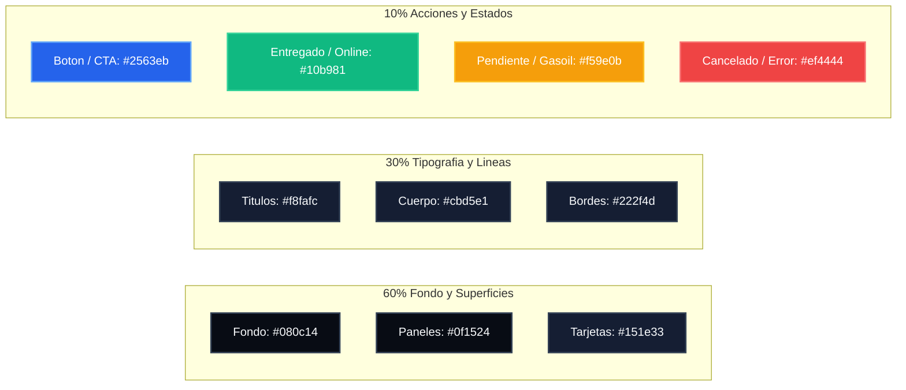

# TerMate — Sistema de Gestion de Rutas y Logistica de Cargas

Plataforma integral disenada para la administracion de flotas pesadas, trazado de rutas para camiones en la Republica Argentina y emision digital de remitos con funcionamiento resiliente sin conexion.

---

## 1. Arquitectura de Pantallas y Navegacion



---

## 2. Flujo de Usuario y Operacion



---

## 3. Sistema de Color y Tokens Visuales



---

## 4. Capacidades Principales

| Modulo | Descripcion Tecnica |
| :--- | :--- |
| **Geocodificacion Federal** | Integracion con SerpApi Google Maps Engine, GeoRef Nacional y Nominatim con fallback a dataset argentino. |
| **Trazado para Camiones** | Calculo con perfil HGV (Heavy Goods Vehicle) respetando dimensiones, alturas maximas y cargas por eje. |
| **Marcadores Interactivos** | Marcadores desbloqueables con doble clic y arrastre fluido con recalculo dinamico de distancias y consumo. |
| **Puntos de Interes (POIs)** | Visualizacion de estaciones de servicio y paradores de descanso con calificaciones y opiniones en tiempo real. |
| **Emision de Remitos** | Formato de remito oficial con codigo de barras/QR digital, comprobante para impresion termica y A4. |
| **Scoring de Choferes** | Evaluacion de cumplimiento de ruta, puntualidad, incidencias, historial de carnets y asignacion de bonos. |
| **Resiliencia Offline** | Service Worker PWA de alta velocidad que permite la operacion sin senal en rutas nacionales. |

---

## 5. Instalacion y Ejecucion

La aplicacion no requiere dependencias pesadas ni servidores complejos. Para ejecutarla localmente:

1. Clonar el repositorio:
   ```bash
   git clone https://github.com/agus123e21/gestion.0.0.2.git
   ```
2. Iniciar un servidor web local (por ejemplo con Python o Node):
   ```bash
   python -m http.server 8000
   ```
   o bien:
   ```bash
   npx serve .
   ```
3. Abrir en el navegador: `http://localhost:8000`.

---

## 6. Licencia
Proyecto desarrollado para gestion y transporte logistico bajo estandares abiertos.