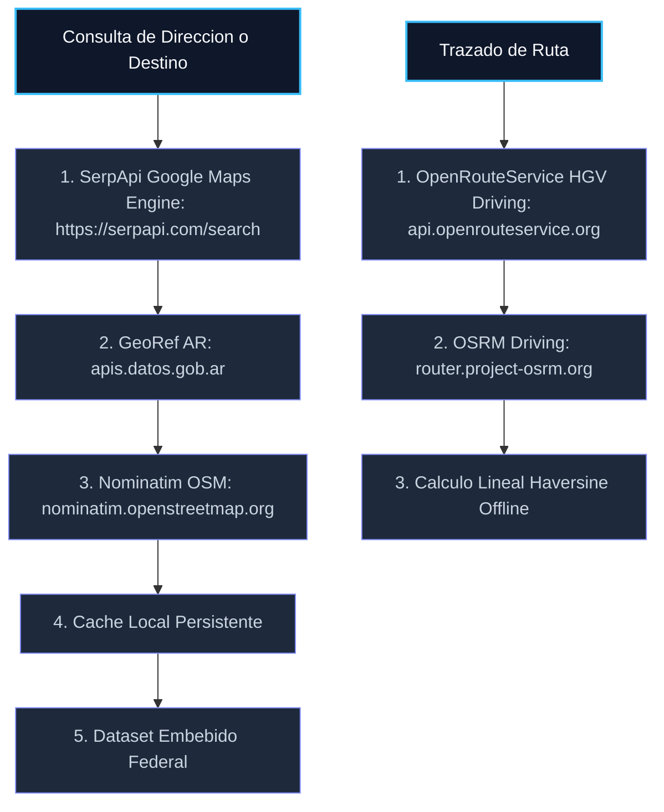

# Documentacion de APIs Integradas — TerMate

Este documento detalla el funcionamiento tecnico, endpoints, parametros y formatos de respuesta de las APIs externas integradas en el sistema de gestion de fletes TerMate.

---

## 1. Arquitectura de Geocodificacion y Rutas



---

## 2. Geocodificacion y Autocompletado

### 2.1 SerpApi — Google Maps Search Engine
Motor principal de geocodificacion y autocompletado en tiempo real. Utiliza la sintaxis del motor de Google Maps via SerpApi (`engine=google_maps`) para resolver ubicaciones, direcciones completas y coordenadas de latitud/longitud (`gps_coordinates`).

- **Metodo:** `GET`
- **Endpoint:** `https://serpapi.com/search?engine=google_maps` (o `https://serpapi.com/search.json?engine=google_maps`)
- **Link Oficial:** [https://serpapi.com/search?engine=google_maps](https://serpapi.com/search?engine=google_maps)

#### Parametros de Consulta:
| Parametro | Tipo | Valor / Ejemplo | Descripcion |
| :--- | :--- | :--- | :--- |
| `engine` | String | `google_maps` | Especifica el motor de busqueda de Google Maps. |
| `q` | String | `Av Corrientes 1234, Buenos Aires` | Direccion, localidad o punto de interes buscado. |
| `gl` | String | `ar` | Codigo de pais para Argentina. |
| `hl` | String | `es` | Idioma de respuesta en espanol. |
| `api_key` | String | `[TU_API_KEY]` | Clave personal de SerpApi (guardada en localStorage). |

#### Ejemplo de Peticion:
```http
GET https://serpapi.com/search?engine=google_maps&q=Av+Corrientes+1234+Buenos+Aires&gl=ar&hl=es&api_key=YOUR_SERPAPI_KEY
```

---

### 2.2 Nominatim (OpenStreetMap) — Fallback Secundario
Servicio de respaldo para resolucion de direcciones en caso de indisponibilidad de red o de clave de API.

- **Metodo:** `GET`
- **Endpoint:** `https://nominatim.openstreetmap.org/search`
- **Headers requeridos:**
  - `User-Agent: TerMate/2.1`

---

### 2.3 API GeoRef (Gobierno de la Nacion Argentina)
Utilizada para la normalizacion oficial de direcciones publicas de catastro y nombres de calles bajo estandares gubernamentales del IGN.

- **Metodo:** `GET`
- **Endpoint:** `https://apis.datos.gob.ar/georef/api/v2.1/direcciones`

---

## 3. Calculo de Rutas y Enrutamiento Pesado

### 3.1 OpenRouteService (ORS) — Perfil HGV (Heavy Goods Vehicle)
Calcula la trayectoria optima para vehiculos de carga, evitando obstaculos fisicos o legales en base a las dimensiones ingresadas por el operador en el perfil de su camion.

- **Metodo:** `POST`
- **Endpoint:** `https://api.openrouteservice.org/v2/directions/driving-hgv`
- **Headers requeridos:**
  - `Content-Type: application/json`
  - `Authorization: [TU_API_KEY]` (Opcional en modo publico / demo)

#### Estructura del Body (JSON):
```json
{
  "coordinates": [
    [-58.3815, -34.6037], 
    [-64.1885, -31.4168]
  ],
  "options": {
    "profile_params": {
      "restrictions": {
        "height": 4.0,
        "width": 2.5,
        "length": 18.0,
        "weight": 20.0,
        "axleload": 6.7
      }
    }
  }
}
```

---

### 3.2 OSRM (Open Source Routing Machine) — Fallback Estandar
API secundaria de enrutamiento en tiempo real. Calcula rutas sobre la red vial con pasos detallados y coordenadas completas.

- **Metodo:** `GET`
- **Endpoint:** `https://router.project-osrm.org/route/v1/driving/{lon_origen},{lat_origen};{lon_destino},{lat_destino}?overview=full&geometries=geojson&steps=true`

---

## 4. Calculo de Consumo Real de Combustible

El consumo promedio de un camion en ruta varia segun la carga util transportada. TerMate utiliza un modelo de interpolacion lineal:

### Formula de Consumo por Viaje:
$$C_{\text{estimado}} = \left( C_{\text{vacio}} + (C_{\text{lleno}} - C_{\text{vacio}}) \times \min\left(1, \frac{P_{\text{carga}}}{P_{\text{max}}}\right) \right) \times \frac{D}{100}$$

- $C_{\text{vacio}}$: Consumo del camion sin carga en L/100 km (ej: 25 L).
- $C_{\text{lleno}}$: Consumo del camion a carga maxima en L/100 km (ej: 38 L).
- $P_{\text{max}}$: Capacidad maxima de carga del camion en toneladas (ej: 20 tn).
- $P_{\text{carga}}$: Peso actual de la carga asignada al viaje en toneladas.
- $D$: Distancia total calculada para la ruta en kilometros.

---

## 5. Fallback de Enrutamiento (Fuera de Linea)

Cuando el dispositivo se encuentra sin senal de red (offline), el sistema activa el calculo por Formula de Haversine (distancia del gran circulo):

$$\text{d} = 2R \arcsin \left( \sqrt{\sin^2\left(\frac{\Delta \text{lat}}{2}\right) + \cos(\text{lat}_1)\cos(\text{lat}_2)\sin^2\left(\frac{\Delta \text{lon}}{2}\right)} \right)$$

- $R = 6371\text{ km}$ (Radio medio de la Tierra).
- Velocidad de simulacion por defecto: $70\text{ km/h}$.
- Trayectoria: Linea recta directa entre el punto de origen y destino con modo de ajuste manual.
